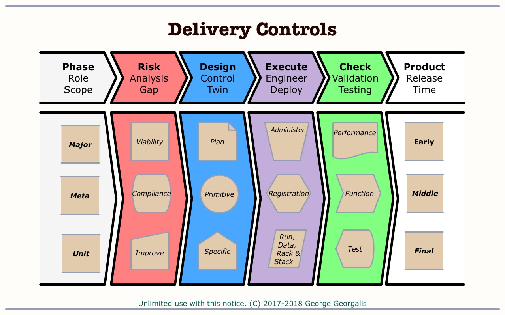

# Felidae Information Flows 

This repository is a work plan and source code product for
Felidae information services.

This data flow scales and improves the existing Felidae camera trap to data report process.
Automation is used to standardize formats and accelerate the pipeline wherever possible.
Discrete components are designed to meet today's needs and adapt to future changing needs and scale.

## Overview

Images and video are recorded in strategically placed camera traps.
Periodically the memory cards are retrieved and needful field data is noted.
A Raspberry Pi class wifi device receives the media and packages it with notebook annotations entered through a web interface.
The media is then categorized within the package by an AI tool.
A web interface presents pre-categorized media for manual corrections and/or upload to master storage (and backup).
Additional corrections and/or AI training takes place from the master, until packages are exported as CSV and media files.
Reports are generated from the data and uploaded back to the master.
Any number of Raspberry Pi class devices may be used with an expected to cost of $20-$50 per site, or $15 each for an upload only version (NodeMCU class).

## Design
### Glossary

### Process
Since this product is implemented and consumed primarily by
volunteers, with transient time availability and potential
for high turn over, a special focus on planning documentation,
automated operations and deployment robustness will be applied.

The general implementation pattern consists of four phases feeding
each other in a continuous loop cycle: Risk Analysis, Planning,
Execution and Quality Check. Three degrees of detail compose
each phase: Major, Meta and Minor details. Likewise, the degrees
of development are expected to mature in Early, Middle and Final
stages of the project refinement. 

This process allows for each of the four phases to be developed
asynchronously, yet becoming tightly coupled as development
matures. It is loosly based on the "Delivery Controls"
and "Objective Improvement" slides in this operations deck
https://github.com/georgalis/pub/blob/master/know/Operations.pdf

* Major
  * Viability (Risk)
  * Twin (Design)
  * Administer (Execute)
  * Performance (Check)
* Meta
  * Compliance (Risk)
  * Primitive (Design)
  * Registration (Execute)
  * Function (Check)
* Detail
  * Improve (Risk)
  * Specification (design)
  * Implementation (Execute)
  * Test (Check)
* Product

###  Major
* waterfall
####  Viability (Risk)
* Offsite backup - data disaster recovery
* Instantiation - hardware disaster recovery
* Diagnostic - event logs, repair table
* Extendability - future flexability
* reliability - robust
* ease of use - low barrier use
* implementation cost
* ongoing cost
####  Twin (Design)
* Glacier - low cost disaster storage, 
  * https://docs.aws.amazon.com/amazonglacier/latest/dev/introduction.html
  * https://aws.amazon.com/glacier/pricing/
* data
  * schema
  * flows

  * translation (old to new format)
* web interface - user zero install
  * workflows
  * markup
####  Administer (Execute)
####  Performance (Check)
###  Meta
####  Compliance (Risk)
####  Primitive (Design)
* components
####  Registration (Execute)
* Requirement Traceability Matrix
####  Function (Check)
###  Detail
####  Improve (Risk)
####  Specification (design)
* Requirements
####  Implementation (Execute)
####  Test (Check)
###  Product

